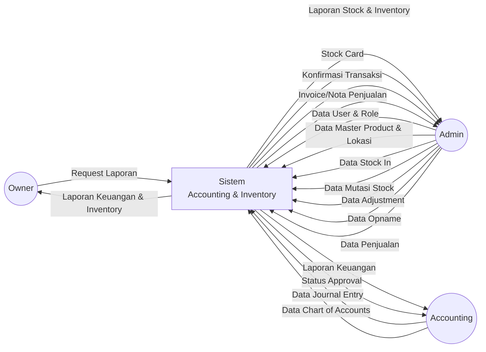
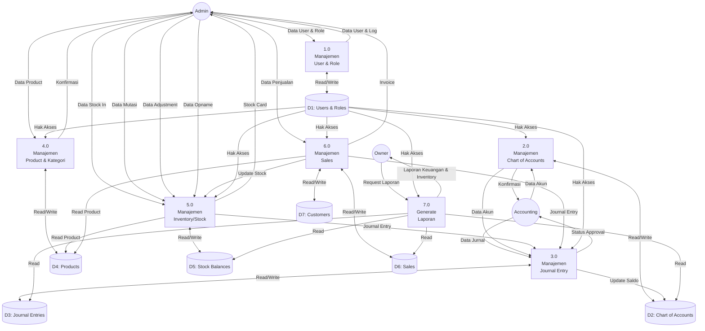
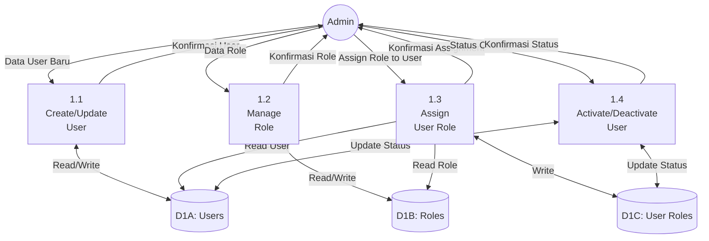
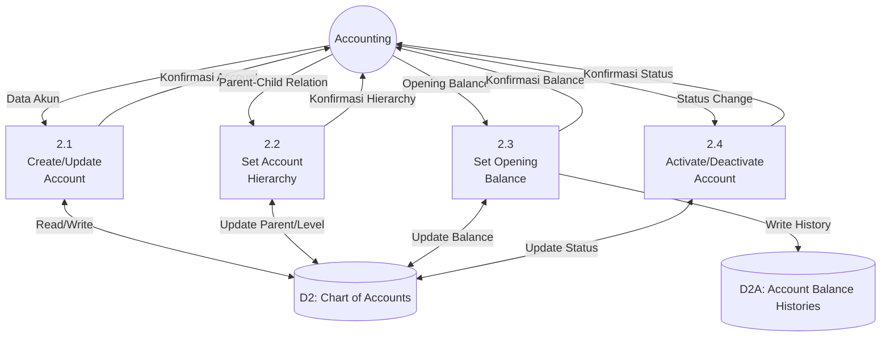
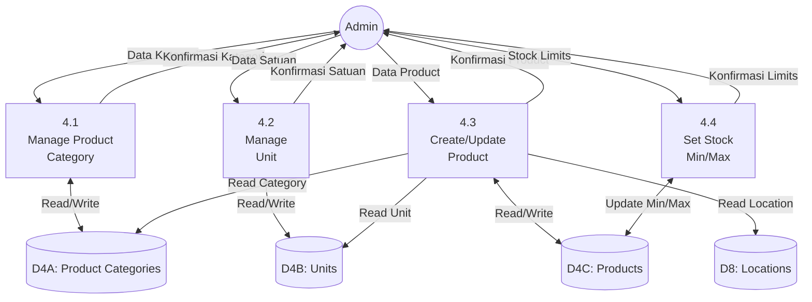
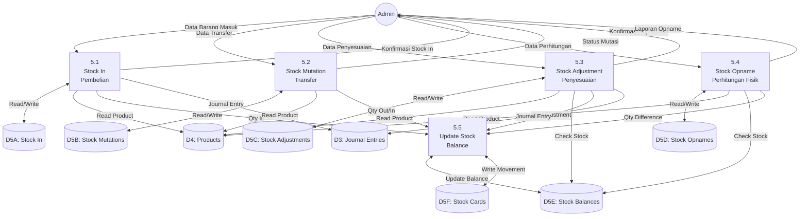
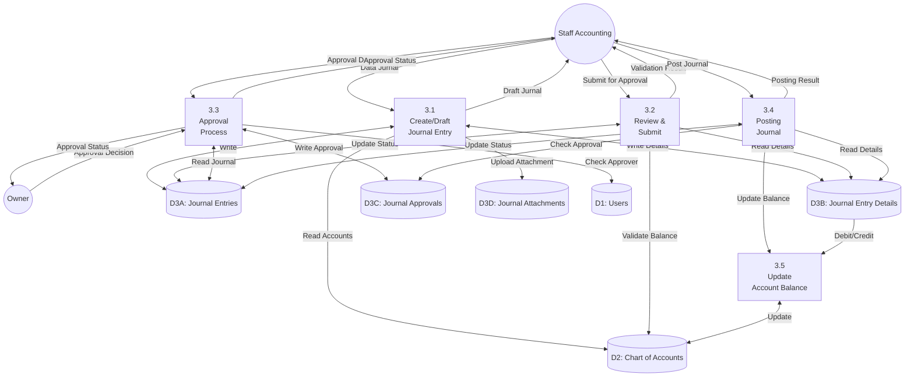
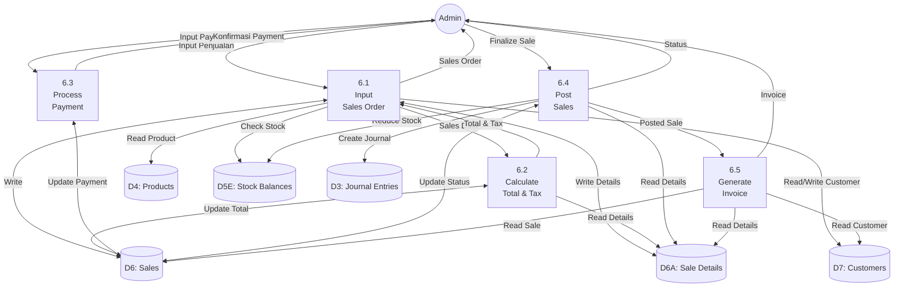
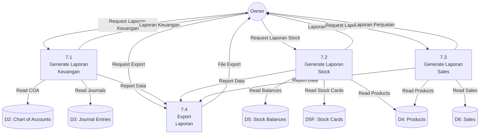

# Data Flow Diagram (DFD) - Sistem 
## Sistem Informasi Akuntansi dan Inventory Management

---

## DFD Level 0 (Context Diagram)

**Keterangan:**
- **SINTIYA**: Sistem Informasi Akuntansi dan Inventory Management
- **External Entities**: Owner (laporan), Admin (inventory & sales), Accounting (akuntansi)
- **Data Flows**: Menggambarkan aliran data dari dan ke sistem

---

## DFD Level 1

**Keterangan Proses Level 1:**

| No | Proses | Deskripsi |
|---|---|---|
| 1.0 | Manajemen User & Role | Mengelola data user, role, dan hak akses sistem |
| 2.0 | Manajemen Chart of Accounts | Mengelola bagan akun (COA) dan struktur akuntansi |
| 3.0 | Manajemen Journal Entry | Mengelola jurnal akuntansi, approval, dan posting |
| 4.0 | Manajemen Product & Kategori | Mengelola master data produk, kategori, dan satuan |
| 5.0 | Manajemen Inventory/Stock | Mengelola stock in, mutasi, adjustment, dan opname |
| 6.0 | Manajemen Sales | Mengelola transaksi penjualan dan customer |
| 7.0 | Generate Laporan | Menghasilkan berbagai laporan keuangan dan inventory |

**Data Stores:**

| ID | Data Store | Deskripsi |
|---|---|---|
| D1 | Users & Roles | Menyimpan data user, role, dan permissions |
| D2 | Chart of Accounts | Menyimpan bagan akun dan saldo |
| D3 | Journal Entries | Menyimpan jurnal entry dan detail transaksi |
| D4 | Products | Menyimpan master data produk, kategori, unit |
| D5 | Stock Balances | Menyimpan data stock, kartu stock, transaksi |
| D6 | Sales | Menyimpan transaksi penjualan dan detailnya |
| D7 | Customers | Menyimpan data customer |

---

## DFD Level 2 - Proses 1.0 (Manajemen User & Role)

**Keterangan Sub-Proses 1.0:**

| No | Sub-Proses | Deskripsi |
|---|---|---|
| 1.1 | Create/Update User | Membuat atau mengubah data user |
| 1.2 | Manage Role | Mengelola role dan permissions |
| 1.3 | Assign User Role | Assign role ke user tertentu |
| 1.4 | Activate/Deactivate User | Mengaktifkan atau menonaktifkan user |

---

## DFD Level 2 - Proses 2.0 (Manajemen Chart of Accounts)

**Keterangan Sub-Proses 2.0:**

| No | Sub-Proses | Deskripsi |
|---|---|---|
| 2.1 | Create/Update Account | Membuat atau mengubah akun baru |
| 2.2 | Set Account Hierarchy | Mengatur struktur parent-child akun |
| 2.3 | Set Opening Balance | Set saldo awal akun |
| 2.4 | Activate/Deactivate Account | Mengaktifkan atau menonaktifkan akun |

---

## DFD Level 2 - Proses 4.0 (Manajemen Product & Kategori)

**Keterangan Sub-Proses 4.0:**

| No | Sub-Proses | Deskripsi |
|---|---|---|
| 4.1 | Manage Product Category | Mengelola kategori produk |
| 4.2 | Manage Unit | Mengelola satuan produk |
| 4.3 | Create/Update Product | Membuat atau mengubah data produk |
| 4.4 | Set Stock Min/Max | Set minimum dan maksimum stock |

---

## DFD Level 2 - Proses 5.0 (Manajemen Inventory/Stock)

**Keterangan Sub-Proses 5.0:**

| No | Sub-Proses | Deskripsi |
|---|---|---|
| 5.1 | Stock In (Pembelian) | Mencatat barang masuk dari supplier |
| 5.2 | Stock Mutation (Transfer) | Mencatat transfer antar lokasi/gudang |
| 5.3 | Stock Adjustment (Penyesuaian) | Mencatat penyesuaian stock karena selisih |
| 5.4 | Stock Opname (Perhitungan Fisik) | Mencatat hasil perhitungan fisik stock |
| 5.5 | Update Stock Balance | Memperbarui saldo stock dan kartu stock |

---

## DFD Level 2 - Proses 3.0 (Manajemen Journal Entry)

**Keterangan Sub-Proses 3.0:**

| No | Sub-Proses | Deskripsi |
|---|---|---|
| 3.1 | Create/Draft Journal Entry | Membuat draft jurnal baru dengan detail debit/kredit |
| 3.2 | Review & Submit | Validasi dan submit jurnal untuk approval |
| 3.3 | Approval Process | Proses persetujuan jurnal oleh approver |
| 3.4 | Posting Journal | Posting jurnal yang sudah diapprove |
| 3.5 | Update Account Balance | Memperbarui saldo akun setelah posting |

---

## DFD Level 2 - Proses 6.0 (Manajemen Sales)

**Keterangan Sub-Proses 6.0:**

| No | Sub-Proses | Deskripsi |
|---|---|---|
| 6.1 | Input Sales Order | Input data penjualan dan item yang dijual |
| 6.2 | Calculate Total & Tax | Hitung subtotal, pajak, dan total penjualan |
| 6.3 | Process Payment | Proses pembayaran dari customer |
| 6.4 | Post Sales | Posting penjualan, kurangi stock, buat jurnal |
| 6.5 | Generate Invoice | Generate invoice/nota untuk customer |

---

## DFD Level 2 - Proses 7.0 (Generate Laporan)

**Keterangan Sub-Proses 7.0:**

| No | Sub-Proses | Deskripsi |
|---|---|---|
| 7.1 | Generate Laporan Keuangan | Generate neraca, laba rugi, buku besar |
| 7.2 | Generate Laporan Stock | Generate laporan stock, kartu stock |
| 7.3 | Generate Laporan Sales | Generate laporan penjualan |
| 7.4 | Export Laporan | Export laporan ke PDF/Excel |

---

## Rangkuman DFD

### DFD Level 0
- Menggambarkan sistem  sebagai satu kesatuan
- Menunjukkan 3 external entities: Owner (laporan), Admin (inventory & sales), Accounting (akuntansi)
- Menunjukkan aliran data utama dari/ke sistem

### DFD Level 1
- Memecah sistem menjadi 7 proses utama
- Menunjukkan 7 data stores utama
- Menunjukkan aliran data antar proses dan data stores

### DFD Level 2
- Detail dari 7 proses utama:
  - **Proses 1.0**: Manajemen User & Role (4 sub-proses)
  - **Proses 2.0**: Manajemen Chart of Accounts (4 sub-proses)
  - **Proses 3.0**: Manajemen Journal Entry (5 sub-proses)
  - **Proses 4.0**: Manajemen Product & Kategori (4 sub-proses)
  - **Proses 5.0**: Manajemen Inventory (5 sub-proses)
  - **Proses 6.0**: Manajemen Sales (5 sub-proses)
  - **Proses 7.0**: Generate Laporan (4 sub-proses)

---

## Catatan Penting

1. **Konvensi Penomoran:**
   - Level 0: Sistem tunggal
   - Level 1: Proses utama (1.0, 2.0, 3.0, ...)
   - Level 2: Sub-proses (3.1, 3.2, 3.3, ...)

2. **Data Stores:**
   - Menggunakan notasi D1, D2, D3, dst untuk data stores utama
   - Sub-stores menggunakan notasi D3A, D3B, dst

3. **Aliran Data:**
   - Panah menunjukkan arah aliran data
   - Setiap aliran data harus diberi label yang jelas
   - Tidak ada control flow, hanya data flow

4. **External Entities:**
   - Digambarkan sebagai persegi atau lingkaran
   - Merepresentasikan sumber atau tujuan data di luar sistem

5. **Proses:**
   - Digambarkan sebagai lingkaran atau persegi dengan sudut melengkung
   - Setiap proses harus memiliki input dan output
   - Diberi nomor untuk identifikasi

---

**Dibuat untuk:** Sistem  - Sistem Informasi Akuntansi dan Inventory Management
**Versi:** 1.0
**Tanggal:** 24 Desember 2025
