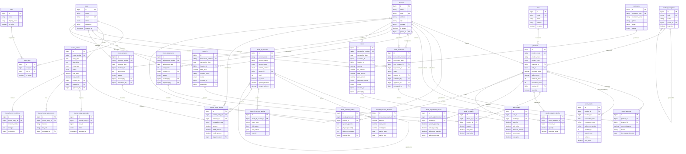

```mermaid
erDiagram
    users ||--o{ user_roles : has
    roles ||--o{ user_roles : "assigned to"
    users ||--o{ journal_entries : creates
    users ||--o{ stock_mutations : manages
    users ||--o{ stock_adjustments : manages
    users ||--o{ stock_opnames : manages
    users ||--o{ stock_in : manages
    users ||--o{ sales : creates

    chart_of_accounts ||--o{ chart_of_accounts : "parent-child"
    chart_of_accounts ||--o{ account_balance_histories : tracks
    chart_of_accounts ||--o{ chart_of_account_audits : audited
    chart_of_accounts ||--o{ journal_entry_details : "used in"

    journal_entries ||--o{ journal_entry_details : contains
    journal_entries ||--o{ journal_entry_approvals : requires
    journal_entries ||--o{ journal_entry_attachments : has
    journal_entries ||--o{ journal_entry_revisions : revised

    product_categories ||--o{ product_categories : "parent-child"
    product_categories ||--o{ products : categorizes
    units ||--o{ products : measures
    locations ||--o{ products : stores
    products ||--o{ stock_balances : "tracked in"
    products ||--o{ stock_cards : "movement history"
    products ||--o{ stock_in_details : received
    products ||--o{ stock_mutation_details : transferred
    products ||--o{ stock_adjustment_details : adjusted
    products ||--o{ stock_opname_details : counted
    products ||--o{ sale_details : sold

    locations ||--o{ locations : "parent-child"
    locations ||--o{ stock_balances : "holds stock"
    locations ||--o{ stock_cards : "tracks movement"
    locations ||--o{ stock_in : receives
    locations ||--o{ stock_mutations : "from location"
    locations ||--o{ stock_mutations : "to location"
    locations ||--o{ stock_adjustments : "adjusted at"
    locations ||--o{ stock_opnames : "opname at"
    locations ||--o{ sales : "sells from"
    locations ||--o{ journal_entry_details : department

    stock_in ||--o{ stock_in_details : contains
    stock_mutations ||--o{ stock_mutation_details : contains
    stock_adjustments ||--o{ stock_adjustment_details : contains
    stock_opnames ||--o{ stock_opname_details : contains

    customers ||--o{ sales : purchases
    sales ||--o{ sale_details : contains

    users {
        bigint id PK
        string name
        string email UK
        enum status
        string password
        timestamp created_at
    }

    roles {
        bigint id PK
        string name UK
        string display_name
        boolean is_active
    }

    user_roles {
        bigint id PK
        bigint user_id FK
        bigint role_id FK
        boolean is_active
    }

    chart_of_accounts {
        bigint id PK
        string account_code UK
        string account_name
        enum account_type
        enum normal_balance
        bigint parent_id FK
        int level
        boolean is_active
        decimal opening_balance
        decimal current_balance
    }

    account_balance_histories {
        bigint id PK
        bigint chart_of_account_id FK
        decimal balance
        decimal debit_total
        decimal credit_total
        date period_start
        date period_end
    }

    chart_of_account_audits {
        bigint id PK
        bigint chart_of_account_id FK
        string event_type
        json old_values
        json new_values
        string user_id
    }

    journal_entries {
        bigint id PK
        string entry_number UK
        date entry_date
        text description
        enum entry_type
        enum status
        decimal total_debit
        decimal total_credit
        bigint created_by FK
        bigint posted_by FK
        bigint approved_by FK
    }

    journal_entry_details {
        bigint id PK
        bigint journal_entry_id FK
        bigint account_id FK
        enum transaction_type
        decimal amount
        decimal debit_amount
        decimal credit_amount
        bigint department_id FK
    }

    journal_entry_approvals {
        bigint id PK
        bigint journal_entry_id FK
        bigint user_id FK
        enum status
        timestamp approved_at
    }

    journal_entry_attachments {
        bigint id PK
        bigint journal_entry_id FK
        string filename
        string file_path
        bigint uploaded_by FK
    }

    journal_entry_revisions {
        bigint id PK
        bigint journal_entry_id FK
        int revision_number
        json changes
        bigint revised_by FK
    }

    products {
        bigint id PK
        string product_code UK
        string product_name
        enum product_type
        bigint category_id FK
        bigint unit_id FK
        decimal purchase_price
        decimal selling_price
        int minimum_stock
        int maximum_stock
        bigint location_id FK
        boolean is_active
    }

    product_categories {
        bigint id PK
        string code UK
        string name
        bigint parent_id FK
        boolean is_active
    }

    units {
        bigint id PK
        string code UK
        string name
        string symbol
        boolean is_active
    }

    locations {
        bigint id PK
        string name
        string code UK
        string address
        string city
        string country
        boolean is_active
        bigint parent_id FK
    }

    stock_balances {
        bigint id PK
        bigint product_id FK
        bigint location_id FK
        decimal current_balance
        string status
        date last_transaction_date
    }

    stock_cards {
        bigint id PK
        bigint product_id FK
        bigint location_id FK
        date transaction_date
        string transaction_type
        string reference_number
        int quantity_in
        int quantity_out
        int balance
        decimal unit_price
    }

    stock_in {
        bigint id PK
        string transaction_number UK
        date transaction_date
        bigint location_id FK
        decimal total_price
        string supplier_name
        enum status
        bigint created_by FK
        bigint posted_by FK
    }

    stock_in_details {
        bigint id PK
        bigint stock_in_id FK
        bigint product_id FK
        decimal quantity
        decimal unit_price
        decimal total_price
    }

    stock_mutations {
        bigint id PK
        string transaction_number UK
        date transaction_date
        bigint from_location_id FK
        bigint to_location_id FK
        enum status
        bigint created_by FK
        bigint submitted_by FK
        bigint approved_by FK
        bigint completed_by FK
    }

    stock_mutation_details {
        bigint id PK
        bigint stock_mutation_id FK
        bigint product_id FK
        decimal quantity
        decimal available_stock
    }

    stock_adjustments {
        bigint id PK
        string adjustment_number UK
        date adjustment_date
        int total_items
        bigint location_id FK
        enum status
        bigint created_by FK
        bigint approved_by FK
    }

    stock_adjustment_details {
        bigint id PK
        bigint stock_adjustment_id FK
        bigint product_id FK
        decimal system_quantity
        decimal actual_quantity
        decimal difference_quantity
        enum adjustment_type
    }

    stock_opnames {
        bigint id PK
        string opname_number UK
        date opname_date
        bigint location_id FK
        int total_items
        enum status
        bigint created_by FK
        bigint completed_by FK
    }

    stock_opname_details {
        bigint id PK
        bigint stock_opname_id FK
        bigint product_id FK
        int system_quantity
        int physical_quantity
        int difference_quantity
        bigint counted_by FK
    }

    sales {
        bigint id PK
        string transaction_number UK
        date transaction_date
        bigint customer_id FK
        bigint location_id FK
        decimal subtotal
        decimal tax_amount
        decimal total_amount
        decimal paid_amount
        enum payment_method
        enum status
        bigint created_by FK
        bigint posted_by FK
    }

    sale_details {
        bigint id PK
        bigint sale_id FK
        bigint product_id FK
        decimal quantity
        decimal unit_price
        decimal discount_amount
        decimal tax_amount
        decimal total_price
    }

    customers {
        bigint id PK
        string customer_code UK
        string customer_name
        string phone
        string email
        enum status
    }
```
