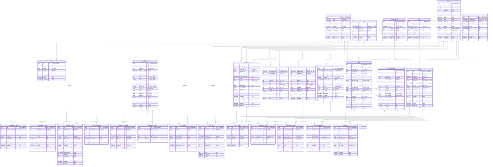

```mermaid
---
config:
  layout: elk
  look: neo
---
erDiagram
	direction TB
	users {
		bigint id PK "AUTO_INCREMENT"  
		varchar(255) name  "NOT NULL"  
		varchar(255) email  "UNIQUE NOT NULL"  
		enum status  "DEFAULT active"  
		varchar(255) password  "NOT NULL"  
		date date_of_birth  "NULL"  
		varchar(20) phone_number  "NULL"  
		text address  "NULL"  
		varchar(255) avatar_url  "NULL"  
		timestamp created_at  "NULL"  
		timestamp updated_at  "NULL"  
	}

	user_roles {
		bigint id PK "AUTO_INCREMENT"  
		bigint user_id FK "NOT NULL"  
		bigint role_id FK "NOT NULL"  
		tinyint is_active  "DEFAULT 0"  
		datetime assigned_at  "DEFAULT CURRENT_TIMESTAMP"  
		datetime expires_at  "NULL"  
		timestamp created_at  "NULL"  
		timestamp updated_at  "NULL"  
	}

	roles {
		bigint id PK "AUTO_INCREMENT"  
		varchar(255) name  "UNIQUE NOT NULL"  
		varchar(255) display_name  "NOT NULL"  
		text description  "NULL"  
		json permissions  "NULL"  
		tinyint is_active  "DEFAULT 1"  
		timestamp created_at  "NULL"  
		timestamp updated_at  "NULL"  
	}

	journal_entries {
		bigint id PK "AUTO_INCREMENT"  
		varchar(255) entry_number  "UNIQUE NOT NULL"  
		date entry_date  "NOT NULL"  
		varchar(255) reference_number  "NULL"  
		text description  "NOT NULL"  
		enum entry_type  "DEFAULT general"  
		enum status  "DEFAULT draft"  
		decimal total_debit  "DEFAULT 0.00"  
		decimal total_credit  "DEFAULT 0.00"  
		varchar(3) currency  "DEFAULT IDR"  
		decimal exchange_rate  "DEFAULT 1.0000"  
		bigint created_by FK "NOT NULL"  
		bigint posted_by FK "NULL"  
		bigint approved_by FK "NULL"  
		bigint updated_by FK "NULL"  
		timestamp posted_at  "NULL"  
		timestamp approved_at  "NULL"  
		json metadata  "NULL"  
		timestamp created_at  "NULL"  
		timestamp updated_at  "NULL"  
		timestamp deleted_at  "NULL"  
	}

	stock_mutations {
		bigint id PK "AUTO_INCREMENT"  
		varchar(255) transaction_number  "UNIQUE NOT NULL"  
		date transaction_date  "NOT NULL"  
		bigint from_location_id FK "NOT NULL"  
		bigint to_location_id FK "NOT NULL"  
		varchar(255) reference_number  "NULL"  
		text notes  "NULL"  
		enum status  "DEFAULT draft"  
		bigint created_by FK "NOT NULL"  
		bigint submitted_by FK "NULL"  
		bigint approved_by FK "NULL"  
		bigint completed_by FK "NULL"  
		timestamp submitted_at  "NULL"  
		timestamp approved_at  "NULL"  
		timestamp completed_at  "NULL"  
		text rejection_reason  "NULL"  
		timestamp created_at  "NULL"  
		timestamp updated_at  "NULL"  
		timestamp deleted_at  "NULL"  
	}

	stock_adjustments {
		bigint id PK "AUTO_INCREMENT"  
		varchar(255) adjustment_number  "UNIQUE NOT NULL"  
		date adjustment_date  "NOT NULL"  
		text description  "NULL"  
		int total_items  "DEFAULT 0"  
		bigint location_id FK "NOT NULL"  
		text notes  "NULL"  
		enum status  "DEFAULT draft"  
		bigint created_by FK "NOT NULL"  
		bigint approved_by FK "NULL"  
		timestamp approved_at  "NULL"  
		timestamp created_at  "NULL"  
		timestamp updated_at  "NULL"  
		timestamp deleted_at  "NULL"  
	}

	stock_opnames {
		bigint id PK "AUTO_INCREMENT"  
		varchar(255) opname_number  "UNIQUE NOT NULL"  
		date opname_date  "NOT NULL"  
		bigint location_id FK "NOT NULL"  
		int total_items  "DEFAULT 0"  
		text description  "NULL"  
		text notes  "NULL"  
		enum status  "DEFAULT draft"  
		bigint created_by FK "NOT NULL"  
		bigint completed_by FK "NULL"  
		timestamp completed_at  "NULL"  
		timestamp created_at  "NULL"  
		timestamp updated_at  "NULL"  
		timestamp deleted_at  "NULL"  
	}

	stock_in {
		bigint id PK "AUTO_INCREMENT"  
		varchar(255) transaction_number  "UNIQUE NOT NULL"  
		date transaction_date  "NOT NULL"  
		bigint location_id FK "NOT NULL"  
		decimal total_price  "NOT NULL"  
		varchar(255) supplier_name  "NULL"  
		varchar(255) reference_number  "NULL"  
		text notes  "NULL"  
		enum status  "DEFAULT draft"  
		bigint created_by FK "NOT NULL"  
		bigint posted_by FK "NULL"  
		timestamp posted_at  "NULL"  
		timestamp created_at  "NULL"  
		timestamp updated_at  "NULL"  
		timestamp deleted_at  "NULL"  
	}

	sales {
		bigint id PK "AUTO_INCREMENT"  
		varchar(20) transaction_number  "UNIQUE NOT NULL"  
		date transaction_date  "NOT NULL"  
		bigint customer_id FK "NULL"  
		bigint location_id FK "NOT NULL"  
		decimal subtotal  "DEFAULT 0.00"  
		decimal tax_amount  "DEFAULT 0.00"  
		decimal discount_amount  "DEFAULT 0.00"  
		decimal total_amount  "DEFAULT 0.00"  
		decimal paid_amount  "DEFAULT 0.00"  
		decimal change_amount  "DEFAULT 0.00"  
		enum payment_method  "DEFAULT cash"  
		text notes  "NULL"  
		enum status  "DEFAULT draft"  
		bigint created_by FK "NOT NULL"  
		bigint posted_by FK "NULL"  
		timestamp posted_at  "NULL"  
		timestamp created_at  "NULL"  
		timestamp updated_at  "NULL"  
		timestamp deleted_at  "NULL"  
	}

	chart_of_accounts {
		bigint id PK "AUTO_INCREMENT"  
		varchar(20) account_code  "UNIQUE NOT NULL"  
		varchar(255) account_name  "NOT NULL"  
		enum account_type  "NOT NULL"  
		enum normal_balance  "NOT NULL"  
		bigint parent_id FK "NULL"  
		int level  "DEFAULT 1"  
		tinyint is_active  "DEFAULT 1"  
		text description  "NULL"  
		json metadata  "NULL"  
		decimal opening_balance  "DEFAULT 0.00"  
		decimal current_balance  "DEFAULT 0.00"  
		timestamp balance_updated_at  "NULL"  
		varchar(255) created_by  "NULL"  
		varchar(255) updated_by  "NULL"  
		timestamp created_at  "NULL"  
		timestamp updated_at  "NULL"  
		timestamp deleted_at  "NULL"  
	}

	account_balance_histories {
		bigint id PK "AUTO_INCREMENT"  
		bigint chart_of_account_id FK "NOT NULL"  
		decimal balance  "NOT NULL"  
		decimal debit_total  "NOT NULL"  
		decimal credit_total  "NOT NULL"  
		date period_start  "NOT NULL"  
		date period_end  "NOT NULL"  
		varchar(255) calculated_by  "NULL"  
		timestamp created_at  "NULL"  
		timestamp updated_at  "NULL"  
	}

	chart_of_account_audits {
		bigint id PK "AUTO_INCREMENT"  
		bigint chart_of_account_id FK "NOT NULL"  
		varchar(255) event_type  "NOT NULL"  
		json old_values  "NULL"  
		json new_values  "NULL"  
		varchar(255) user_id  "NULL"  
		varchar(255) user_name  "NULL"  
		varchar(255) ip_address  "NULL"  
		varchar(255) user_agent  "NULL"  
		timestamp created_at  "NULL"  
		timestamp updated_at  "NULL"  
	}

	journal_entry_details {
		bigint id PK "AUTO_INCREMENT"  
		bigint journal_entry_id FK "NOT NULL"  
		bigint account_id FK "NOT NULL"  
		enum transaction_type  "NOT NULL"  
		decimal amount  "NOT NULL"  
		decimal debit_amount  "DEFAULT 0.00"  
		decimal credit_amount  "DEFAULT 0.00"  
		decimal quantity  "NULL"  
		decimal unit_price  "NULL"  
		decimal tax_rate  "NULL"  
		decimal tax_amount  "DEFAULT 0.00"  
		varchar(255) reconciliation_id  "NULL"  
		text description  "NULL"  
		bigint department_id FK "NULL"  
		bigint project_id FK "NULL"  
		timestamp created_at  "NULL"  
		timestamp updated_at  "NULL"  
	}

	journal_entry_approvals {
		bigint id PK "AUTO_INCREMENT"  
		bigint journal_entry_id FK "NOT NULL"  
		bigint user_id FK "NOT NULL"  
		enum status  "DEFAULT pending"  
		text notes  "NULL"  
		timestamp approved_at  "NULL"  
		timestamp created_at  "NULL"  
		timestamp updated_at  "NULL"  
	}

	journal_entry_attachments {
		bigint id PK "AUTO_INCREMENT"  
		bigint journal_entry_id FK "NOT NULL"  
		varchar(255) filename  "NOT NULL"  
		varchar(255) original_filename  "NOT NULL"  
		varchar(255) mime_type  "NOT NULL"  
		bigint file_size  "NOT NULL"  
		varchar(255) file_path  "NOT NULL"  
		bigint uploaded_by FK "NOT NULL"  
		timestamp created_at  "NULL"  
		timestamp updated_at  "NULL"  
	}

	journal_entry_revisions {
		bigint id PK "AUTO_INCREMENT"  
		bigint journal_entry_id FK "NOT NULL"  
		int revision_number  "NOT NULL"  
		json changes  "NOT NULL"  
		bigint revised_by FK "NOT NULL"  
		text revision_notes  "NULL"  
		timestamp created_at  "DEFAULT CURRENT_TIMESTAMP"  
	}

	product_categories {
		bigint id PK "AUTO_INCREMENT"  
		varchar(50) code  "UNIQUE NOT NULL"  
		varchar(255) name  "NOT NULL"  
		text description  "NULL"  
		bigint parent_id FK "NULL"  
		tinyint is_active  "DEFAULT 1"  
		timestamp created_at  "NULL"  
		timestamp updated_at  "NULL"  
		timestamp deleted_at  "NULL"  
	}

	products {
		bigint id PK "AUTO_INCREMENT"  
		varchar(50) product_code  "UNIQUE NOT NULL"  
		varchar(255) product_name  "NOT NULL"  
		text description  "NULL"  
		enum product_type  "DEFAULT raw_material"  
		bigint category_id FK "NULL"  
		bigint unit_id FK "NOT NULL"  
		decimal purchase_price  "DEFAULT 0.00"  
		decimal selling_price  "NULL"  
		int minimum_stock  "DEFAULT 0"  
		int maximum_stock  "DEFAULT 0"  
		bigint location_id FK "NULL"  
		tinyint is_active  "DEFAULT 1"  
		timestamp created_at  "NULL"  
		timestamp updated_at  "NULL"  
		timestamp deleted_at  "NULL"  
	}

	units {
		bigint id PK "AUTO_INCREMENT"  
		varchar(20) code  "UNIQUE NOT NULL"  
		varchar(100) name  "NOT NULL"  
		varchar(10) symbol  "NULL"  
		text description  "NULL"  
		tinyint is_active  "DEFAULT 1"  
		timestamp created_at  "NULL"  
		timestamp updated_at  "NULL"  
		timestamp deleted_at  "NULL"  
	}

	locations {
		bigint id PK "AUTO_INCREMENT"  
		varchar(255) name  "NOT NULL"  
		varchar(255) code  "UNIQUE NOT NULL"  
		text description  "NULL"  
		varchar(255) address  "NULL"  
		varchar(255) city  "NULL"  
		varchar(255) state  "NULL"  
		varchar(255) country  "NULL"  
		varchar(255) postal_code  "NULL"  
		decimal latitude  "NULL"  
		decimal longitude  "NULL"  
		varchar(7) color  "DEFAULT #10B981"  
		tinyint is_active  "DEFAULT 1"  
		bigint parent_id FK "NULL"  
		json metadata  "NULL"  
		timestamp created_at  "NULL"  
		timestamp updated_at  "NULL"  
	}

	stock_balances {
		bigint id PK "AUTO_INCREMENT"  
		bigint product_id FK "NOT NULL"  
		bigint location_id FK "NOT NULL"  
		decimal current_balance  "DEFAULT 0.00"  
		decimal minimum_stock  "NULL"  
		decimal maximum_stock  "NULL"  
		varchar(255) status  "DEFAULT in_stock"  
		date last_transaction_date  "NULL"  
		varchar(255) last_transaction_type  "NULL"  
		timestamp created_at  "NULL"  
		timestamp updated_at  "NULL"  
	}

	stock_cards {
		bigint id PK "AUTO_INCREMENT"  
		bigint product_id FK "NOT NULL"  
		bigint location_id FK "NOT NULL"  
		date transaction_date  "NOT NULL"  
		varchar(255) transaction_type  "NOT NULL"  
		bigint reference_id  "NULL"  
		varchar(255) reference_number  "NULL"  
		int quantity_in  "DEFAULT 0"  
		int quantity_out  "DEFAULT 0"  
		int balance  "NOT NULL"  
		decimal unit_price  "DEFAULT 0.00"  
		text notes  "NULL"  
		timestamp created_at  "NULL"  
		timestamp updated_at  "NULL"  
	}

	stock_in_details {
		bigint id PK "AUTO_INCREMENT"  
		bigint stock_in_id FK "NOT NULL"  
		bigint product_id FK "NOT NULL"  
		decimal quantity  "NOT NULL"  
		decimal unit_price  "NOT NULL"  
		decimal total_price  "NOT NULL"  
		text notes  "NULL"  
		timestamp created_at  "NULL"  
		timestamp updated_at  "NULL"  
	}

	stock_mutation_details {
		bigint id PK "AUTO_INCREMENT"  
		bigint stock_mutation_id FK "NOT NULL"  
		bigint product_id FK "NOT NULL"  
		decimal quantity  "NOT NULL"  
		decimal available_stock  "DEFAULT 0.00"  
		text notes  "NULL"  
		timestamp created_at  "NULL"  
		timestamp updated_at  "NULL"  
	}

	stock_adjustment_details {
		bigint id PK "AUTO_INCREMENT"  
		bigint stock_adjustment_id FK "NOT NULL"  
		bigint product_id FK "NOT NULL"  
		decimal system_quantity  "DEFAULT 0.00"  
		decimal actual_quantity  "DEFAULT 0.00"  
		decimal difference_quantity  "DEFAULT 0.00"  
		enum adjustment_type  "NOT NULL"  
		varchar(255) reason  "NULL"  
		text notes  "NULL"  
		timestamp created_at  "NULL"  
		timestamp updated_at  "NULL"  
	}

	stock_opname_details {
		bigint id PK "AUTO_INCREMENT"  
		bigint stock_opname_id FK "NOT NULL"  
		bigint product_id FK "NOT NULL"  
		int system_quantity  "NOT NULL"  
		int physical_quantity  "NOT NULL"  
		int difference_quantity  "NOT NULL"  
		enum adjustment_type  "NULL"  
		text notes  "NULL"  
		bigint counted_by FK "NULL"  
		timestamp created_at  "NULL"  
		timestamp updated_at  "NULL"  
	}

	sale_details {
		bigint id PK "AUTO_INCREMENT"  
		bigint sale_id FK "NOT NULL"  
		bigint product_id FK "NOT NULL"  
		decimal quantity  "NOT NULL"  
		decimal unit_price  "NOT NULL"  
		decimal discount_percent  "DEFAULT 0.00"  
		decimal discount_amount  "DEFAULT 0.00"  
		decimal tax_percent  "DEFAULT 0.00"  
		decimal tax_amount  "DEFAULT 0.00"  
		decimal total_price  "NOT NULL"  
		text notes  "NULL"  
		timestamp created_at  "NULL"  
		timestamp updated_at  "NULL"  
	}

	customers {
		bigint id PK "AUTO_INCREMENT"  
		varchar(20) customer_code  "UNIQUE NOT NULL"  
		varchar(255) customer_name  "NOT NULL"  
		text address  "NULL"  
		varchar(20) phone  "NULL"  
		varchar(255) email  "NULL"  
		text notes  "NULL"  
		enum status  "DEFAULT active"  
		timestamp created_at  "NULL"  
		timestamp updated_at  "NULL"  
		timestamp deleted_at  "NULL"  
	}

	Untitled-Entity {

	}

	users||--o{user_roles:"user_id"
	roles||--o{user_roles:"role_id"
	users||--o{journal_entries:"created_by"
	users||--o{stock_mutations:"created_by"
	users||--o{stock_adjustments:"created_by"
	users||--o{stock_opnames:"created_by"
	users||--o{stock_in:"created_by"
	users||--o{sales:"created_by"
	chart_of_accounts||--o{chart_of_accounts:"parent_id"
	chart_of_accounts||--o{account_balance_histories:"chart_of_account_id"
	chart_of_accounts||--o{chart_of_account_audits:"chart_of_account_id"
	chart_of_accounts||--o{journal_entry_details:"account_id"
	journal_entries||--o{journal_entry_details:"journal_entry_id"
	journal_entries||--o{journal_entry_approvals:"journal_entry_id"
	journal_entries||--o{journal_entry_attachments:"journal_entry_id"
	journal_entries||--o{journal_entry_revisions:"journal_entry_id"
	product_categories||--o{product_categories:"parent_id"
	product_categories||--o{products:"category_id"
	units||--o{products:"unit_id"
	locations||--o{products:"location_id"
	products||--o{stock_balances:"product_id"
	products||--o{stock_cards:"product_id"
	products||--o{stock_in_details:"product_id"
	products||--o{stock_mutation_details:"product_id"
	products||--o{stock_adjustment_details:"product_id"
	products||--o{stock_opname_details:"product_id"
	products||--o{sale_details:"product_id"
	locations||--o{locations:"parent_id"
	locations||--o{stock_balances:"location_id"
	locations||--o{stock_cards:"location_id"
	locations||--o{stock_in:"location_id"
	locations||--o{stock_mutations:"from_location_id"
	locations||--o{stock_mutations:"to_location_id"
	locations||--o{stock_adjustments:"location_id"
	locations||--o{stock_opnames:"location_id"
	locations||--o{sales:"location_id"
	locations||--o{journal_entry_details:"department_id"
	stock_in||--o{stock_in_details:"stock_in_id"
	stock_mutations||--o{stock_mutation_details:"stock_mutation_id"
	stock_adjustments||--o{stock_adjustment_details:"stock_adjustment_id"
	stock_opnames||--o{stock_opname_details:"stock_opname_id"
	customers||--o{sales:"customer_id"
	sales||--o{sale_details:"sale_id"
	sales}|--|{Untitled-Entity:"  "
```
