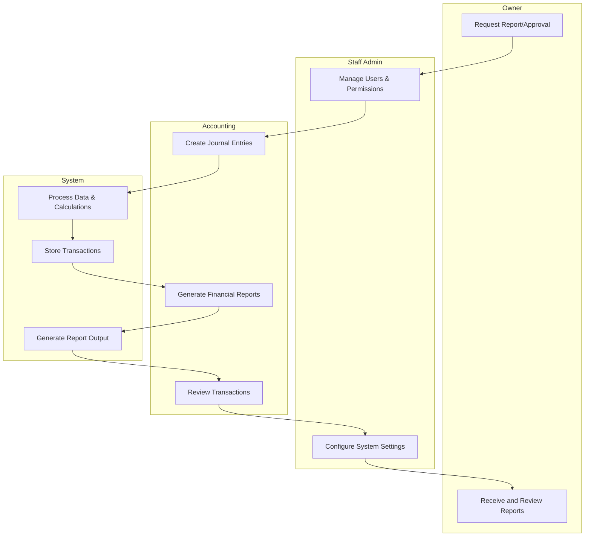

<!-- - Menambahkan tanggal print di bagian cetak semua laporan -->
<!-- - Menambahkan siapa yang menandatangan di bagian bawah laporan keuangannya -->
- Sesuaikan 3.3.2	Analisis Sistem Yang Diusulkan, karena ada penambahkan role user accounting
- Sesuaikan 3.3.3	Gambaran Umum Sistem, masih belum menggambarkan sistem secara utuh dan versi terbaru
<!-- - Tambahkan ERD sebelum pembahasan CDM -->
<!-- - Bab 4 hilangkan 1 UI yaitu "Pengaturan Sistem" -->
<!-- - Bab 4 perlu review dan cocokan dengan bab 3 -->
<!-- - Sesuaikan isi konten blackbox testing di bab 3 agar sesuai dengan bab 4 -->

## Cross-Functional Flowchart Sistem

Berikut adalah diagram alir berbasis fungsi sederhana yang menggambarkan interaksi antara entitas dalam sistem:

